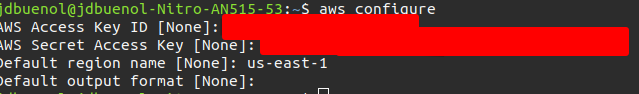
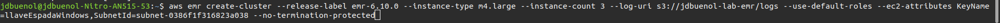
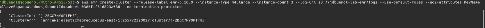
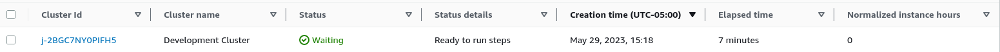

# Guia de como setear un cluster EMR usando la AWS CLI en Ubuntu

## Instalación de la AWS CLI

- Se descargan los archivos necesarios para la instalacion `curl "https://awscli.amazonaws.com/awscli-exe-linux-x86_64.zip" -o "awscliv2.zip"`
- Se descomprimen los archivos descargados `unzip awscliv2.zip`
- Se instala la aws CLI `sudo ./aws/install`

## Configurando las credenciales en la AWS CLI

- Se utiliza el comando `aws configure`
- Se llenan los campos con la informacion correspondiente

- Y se configura el token de la sesion `aws configure set aws_session_token [token de acceso determinado]`

## Instanciacion del Cluster EMR

- Se utiliza el comando `aws emr`
- Con los siguientes parametros:

- `aws emr create-cluster --release-label emr-6.10.0 --instance-type m4.large --instance-count 3 --log-uri s3://[BUCKET NAME]/[LOG FOLDER] --use-default-roles --ec2-attributes KeyName=[KEYNAME],SubnetId=[SUBNET ID] --no-termination-protected`
- la release label equivale a la version de emr que se va a usar, el instance type corresponde al tipo de instancia de EC2 que se van a usar, el instance count es el numero de instancias de EC2 a instanciar, una de las instancias sera la primary y los otros seran core. el Log uri es donde se van a guardar los logs, --use-default-roles asigna los roles por defecto, --ec2-attributes determina que llave de acceso se usara y la subnet en que se instanciaran las instancias y el --no-termination-protected vuelve posible el eliminar el cluster via CLI.
- Finalmente nos retorna la terminal con el id del Cluster creado

- Despues de un par de minutos se puede apreciar el Cluster creado en la consola AWS
