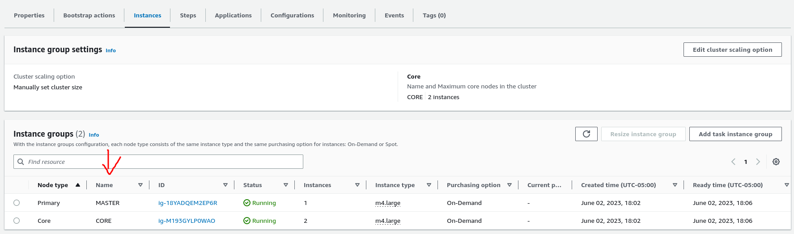

# Reto 5 - Ejecucion de jobs en cluster EMR

## Paso 1 - Montar el cluster

Se hace lo que dice el archivo `ClusterEmrViaCLI.md`

## Paso 2 - setear la estructura del Hadoop File System

Se ingresa mediante ssh al primary node del cluster (MASTER):

login as the user haoop using the command `ssh -i [PEM KEY] hadoop@[PUBLIC DNS OF THE MASTER INSTANCE]`

- Una vez dentro se instala git `sudo yum install git`
- clonar el repositorio `git clone https://github.com/jdbuenol/TET-Reto5.git`
- ingresar al repositorio `cd TET-Reto5`
- clonar los datasets al HDFS `hdfs dfs -copyFromLocal datasets/ /datasets`

## Paso 3 - instalacion de python

- Se instala pip3 usando `sudo yum install python3-pip`
- Se instala MRJOB con pip3 `pip3 install mrjob`

## Paso 4 - ejecucion de los JOBS

- Se crea en el hdfs una carpeta para guardar los resultados `hdfs dfs -mkdir /results`
- Para correr en el cluster `python src/acciones.py hdfs:///datasets/dataAcciones.txt -r hadoop --output-dir hdfs:///results/acciones`
- El primer argumento corresponde al dataset indicado, para los programas de peliculas se usa el dataPeliculas.txt, para los programas de dane se usa el dataDane.txt y para el programa acciones se usa el dataAcciones.txt. Finalmente se pone el argumento --output-dir con la localizacion en el hdfs de donde se guardaran los resultados
- Para visualizar los resultados se puede usar `hdfs dfs -copyToLocal /results/acciones ./resultados` y visualizar con el comando `cat resultados/*`